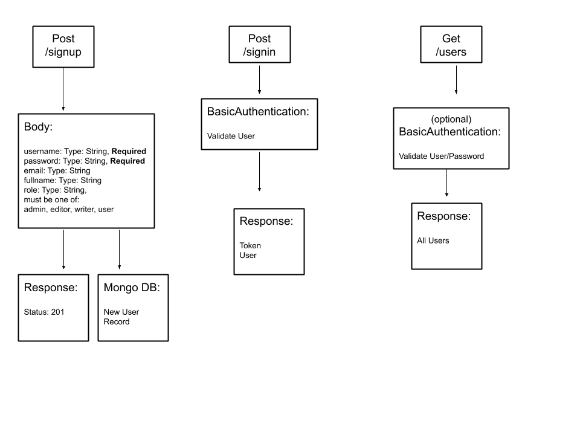

# AUTH-server-# Authentication Server / Module

# Dynamic API Server

## Author: 
Malek Hassan Al-Dalal'ah
## Version: 
1.0.0 
## Overview
An Express/Node.js based server using a custom “authentication” module that is designed to handle user registration and sign in using Basic, Bearer, or OAuth along with a custom “authorization” module that will grant/deny users access to the server based on their role or permissions level.

## Getting Started

These instructions will get you a copy of the project up and running on your local machine for development and testing purposes. See deployment for notes on how to deploy the project on a live system.

## Prerequisites

- Operating system: Mac OS, Windows, Linux
- Git
  Follow the instruction in the links below to install git in your machine
  - [Windows](https://git-scm.com/download/win)
  - [Mac OS](https://git-scm.com/download/mac)
  - [Linux](https://git-scm.com/download/linux)
- [Codeing Editor](https://www.wpbeginner.com/showcase/12-best-code-editors-for-mac-and-windows-for-editing-wordpress-files/)

## Installation

1. open your terminal

2. Clone the repo

`https://github.com/401-advanced-javascript-MalekHassan/AUTH-server-.git`

## Usage

## Architecture

This application was build with express Node.js framwork and it includes:
- jest: test package
- @code-fellows/supergoose: to test the HTTP and mongo database
- morgan: to log the method and the timestamp on the terminal
- cors: to set rules for cross origins
- JWT : to authenticat with json web token
- base46: decode and encode auth headers

# UML diagram

## Change Log
30-10-2020 11:59pm 